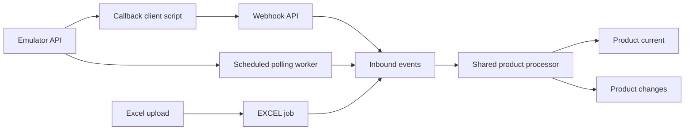

# Prototype Explanation and Demo Guide

## Architecture

The emulator represents the inventory source. CDMS accepts full product snapshots through three channels and applies a shared product processor.



`emulator.products` stores source state. `cdms.processing_jobs` tracks polling and Excel batches; `cdms.inbound_events` retains accepted inputs and outcomes. `cdms.product_current` stores the latest accepted state, while `cdms.product_changes` records accepted content changes, including the initial product creation.

Source versions are an emulator/prototype extension. All channels must refer to the same logical source and use its version convention. Excel upload time is not a source version. The callback is a custom full-snapshot contract, not Vietful's inventory-delta webhook. The prototype implements a product-focused subset rather than the entire Vietful API.

## Setup from a clean checkout

Use Python 3.12 and a running PostgreSQL instance. The following commands use PowerShell from the `CDMS_handson` repository root. The documented setup uses local PostgreSQL; Docker deployment is not completed.

In pgAdmin, connect to the maintenance database (for example `postgres`) and execute these statements separately, outside a transaction, if the databases do not already exist:

```sql
CREATE DATABASE "CDMS";
```

```sql
CREATE DATABASE "CDMS_Test";
```

The database names are case-sensitive in the connection URL. Alembic creates the application schemas/tables, not these databases.

```powershell
python -m venv venv
.\venv\Scripts\Activate.ps1
python -m pip install -e ".[dev]"
Copy-Item .env.example .env
```

Only copy the example when `.env` does not already exist. Edit it with local credentials:

```dotenv
DATABASE_URL=postgresql+psycopg://<user>:<password>@127.0.0.1:5432/CDMS
INVENTORY_BASE_URL=http://127.0.0.1:8000
POLLING_ENABLED=false
POLLING_INTERVAL_SECONDS=30
```

Replace placeholders and URL-encode reserved characters in credentials when necessary. The API, scripts, and workers use `DATABASE_URL`; a separate emulator connection is not needed in the current implementation. Shell environment variables override `.env`, so remove stale test overrides before starting the demo:

```powershell
Remove-Item Env:DATABASE_URL -ErrorAction SilentlyContinue
Remove-Item Env:TEST_DATABASE_URL -ErrorAction SilentlyContinue
python -m alembic upgrade head
python -m alembic current
python -m uvicorn app.main:app --reload
```

Keep this terminal running. Open `http://127.0.0.1:8000/docs` or check health:

```powershell
$base = 'http://127.0.0.1:8000'
Invoke-RestMethod "$base/health"
```

Expect HTTP 200 and `{"Status":"Ok"}`. Run subsequent commands in another terminal at the repository root with the virtual environment activated. Each terminal has its own environment variables.

## API coverage checklist

| Method and path | Demonstration |
| --- | --- |
| GET `/health` | API availability |
| POST `/v1/emulator/products` | Create a version-1 source product |
| GET `/v1/emulator/products` | Paginated source listing |
| GET `/v1/emulator/products/{product_id}` | Read one source snapshot |
| PUT `/v1/emulator/products/{product_id}` | Update source content/status |
| POST `/v1/webhooks/products` | Accept and process a snapshot |
| GET `/v1/events/{event_id}` | Inspect event state; external event IDs also supported |
| POST `/v1/sync/jobs` | Create a manual sync job |
| GET `/v1/sync/jobs/{job_id}` | Inspect sync progress/counters |
| POST `/v1/imports/products` | Upload an Excel batch |
| GET `/v1/imports/{batch_id}` | Inspect batch progress/counters |
| GET `/v1/imports/{batch_id}/errors` | Inspect row errors/conflicts |

Current/history inspection uses PostgreSQL queries; no dedicated current/history REST endpoints are implemented.

## Create a source product with repeatable commands

```powershell
$base = 'http://127.0.0.1:8000'
$source = Invoke-RestMethod -Method Post -Uri "$base/v1/emulator/products" -ContentType 'application/json' -Body '{"sku":"DEMO-API","product_name":"Product A","is_active":true}'
$productId = $source.productId
$source
Invoke-RestMethod "$base/v1/emulator/products?pageIndex=1&pageSize=10"
Invoke-RestMethod "$base/v1/emulator/products/$productId"
```

Expect creation status 201 and `xCdmsVersion=1`. Read by a nonexistent ID returns 404. `pageIndex` must be at least 1 and `pageSize` must be 1–100. Creation rejects string booleans such as `"false"` and extra fields with 422.

```powershell
$source = Invoke-RestMethod -Method Put -Uri "$base/v1/emulator/products/$productId" -ContentType 'application/json' -Body '{"product_name":"Product B","is_active":false}'
$source
```

Changed content increments the source version. Repeating the same update does not increment it. The update implementation applies supplied non-null fields; supplying null does not clear SKU or name. There is no DELETE endpoint.

## 1. Source data and webhook

Run the API as described in README. Stop the polling worker for this demonstration so polling does not process the source first.

```powershell
python -m scripts.seed_emulator --count 10
```

In Swagger, list products using `GET /v1/emulator/products`, select an ID, then send it using:

```powershell
python -m scripts.send_product_webhook --product-id <id>
```

The script fetches the source snapshot and sends it to `POST /v1/webhooks/products`. Use the returned event ID with `GET /v1/events/{event_id}`. Inspect current and history for that product in PostgreSQL.

Run the same script again without changing the source. The deterministic external event ID and unchanged payload should produce a replay response without a new inbound event or change.

For the product ID captured above, the exact commands are:

```powershell
python -m scripts.send_product_webhook --product-id $productId
```

Copy the returned event ID to inspect it:

```powershell
$eventId = '<returned-event-id>'
Invoke-RestMethod "$base/v1/events/$eventId"
```

Replay of the same external event ID is distinct from a new event carrying duplicate product content. To test duplicate/stale/conflict/no-change decisions in Swagger, use a fresh `external_event_id` for each input and this request shape:

```json
{
  "external_event_id": "demo-unique-message-1",
  "event_type": "PRODUCT_SNAPSHOT",
  "source_version": 2,
  "product": {
    "product_id": 10001,
    "sku": "DEMO-10001",
    "name": "Product A",
    "is_active": true
  }
}
```

Replace the ID/version/content with the selected product's current values. Reusing an external event ID with a different request returns HTTP 409. Business CONFLICT is instead recorded on an accepted event; inspect GET event rather than assuming HTTP 202 means a successful product update. Unknown event IDs return 404. Invalid versions, event types, missing fields, or string booleans return 422.

Artificially increasing versions in a manual snapshot can make later emulator snapshots stale. Use separate demo products for artificial version cases and source-driven synchronization.

Update the source using `PUT /v1/emulator/products/{product_id}` in Swagger, then run the script again. A new source version with changed content should update current and append a change.

The webhook service currently invokes processing inside the HTTP request. The 202 response does not indicate a separate asynchronous webhook worker.

## 2. Scheduled polling

Enable polling in `.env` and start `python -m app.workers.sync_worker`. The worker schedules a job immediately, then at configured intervals. An existing active sync job prevents another active job from being created.

Create or update a source product without sending a webhook. Wait for a polling cycle, then inspect the latest SYNC job, its events, and the product's current/history. On an unchanged subsequent cycle, events should be duplicates and history should not grow.

Manual polling is also available through `POST /v1/sync/jobs` and `GET /v1/sync/jobs/{job_id}`. A running sync worker processes manual jobs.

To demonstrate manual jobs first, leave `POLLING_ENABLED=false`. With the worker stopped:

```powershell
$job = Invoke-RestMethod -Method Post -Uri "$base/v1/sync/jobs" -ContentType 'application/json' -Body '{"page_size":100,"max_products":1000}'
$jobId = $job.job_id
Invoke-RestMethod "$base/v1/sync/jobs/$jobId"
```

Expect PENDING; creating another job while this one is active returns 409. Start a separate terminal:

```powershell
.\venv\Scripts\Activate.ps1
python -m app.workers.sync_worker
```

Read the same job again until it finishes. `input_complete=true` means the scan input was persisted, not that every event has completed. Parameters support `page_size` 1–100 and `max_products` 1–10,000; defaults are 100 and 1,000.

For automatic polling, stop the worker, change `.env` to `POLLING_ENABLED=true`, then restart it. Changing `.env` does not change settings already loaded by a running process. A second sync worker should fail to acquire the singleton lock. Stop workers with Ctrl+C after the demo.

## 3. Excel

Create an `.xlsx` file with sheet name `Products` and the exact header:

| product_id | sku | name | is_active | source_version |
| --- | --- | --- | --- | --- |
| 10001 | DEMO-10001 | Example product | TRUE | 1 |

Enter IDs and versions as integer cells, not text. Use an unused product ID or a snapshot/version consistent with the source. Upload through `POST /v1/imports/products`, then inspect `GET /v1/imports/{batch_id}` and `/errors`.

Repeat with one invalid row to demonstrate PARTIAL_SUCCESS and row-level validation errors. File-level errors must reject the upload without creating a batch. Excel processing starts through the API's background task; the separate Excel worker command performs one recovery pass rather than running continuously.

Use Swagger's file picker, or `curl.exe` (not PowerShell's historical `curl` alias):

```powershell
curl.exe -X POST "http://127.0.0.1:8000/v1/imports/products" -F "file=@C:/path/to/products.xlsx"
$batchId = '<returned-batch-id>'
Invoke-RestMethod "$base/v1/imports/$batchId"
Invoke-RestMethod "$base/v1/imports/$batchId/errors"
```

The acceptance response reports PENDING and the number of parsed data rows. Query status separately for the processing result. Excel IDs/versions must be positive integers; name/SKU may be empty; active status may be an Excel boolean or the supported lowercase text `true`/`false`. Arbitrary text such as `yes` is invalid. The first data row has `item_index=2`.

| Excel case | Expected result |
| --- | --- |
| Valid new product | SUCCESS; current/change created |
| Reupload same snapshot | Duplicate event outcome; no new change |
| One valid and one invalid row | PARTIAL_SUCCESS; invalid row available in errors |
| All rows invalid | FAILED |
| Valid header with no data rows | SUCCESS with zero rows |
| Wrong extension/sheet/header or corrupt workbook | 422; no job/events |
| File greater than 5 MiB | 413; no job/events |
| More than 10,000 data rows | Rejected; no job/events |

To run one Excel recovery pass:

```powershell
python -m app.workers.excel_worker
```

It selects one eligible job. A PROCESSING job must have exceeded the current one-hour lease. There is no continuously running Excel recovery loop.

## Version decisions

| Incoming snapshot relative to current | Outcome |
| --- | --- |
| No existing product | SUCCESS; create current and change |
| Older version | STALE; preserve current |
| Same version and content | DUPLICATE |
| Same version, different content | CONFLICT |
| Newer version, same content | NO_CHANGE; advance current version only |
| Newer version, different content | SUCCESS; update current and append change |

History records accepted changes, not every possible source transition. An intermediate source version missed by polling cannot be reconstructed. A return from content A to B to A is a new change when versions increase.

## Evidence to show

Present Swagger responses, related job/event IDs, current/history rows, and the test report. Distinguish automated simulations from live recovery demonstrations. Use a dedicated test database for load and failure experiments.

## Database inspection

In pgAdmin, select the same database used by the services. Replace `10001` and the example UUIDs with actual IDs:

```sql
SELECT * FROM emulator.products WHERE product_id = 10001;
SELECT * FROM cdms.product_current WHERE product_id = 10001;
SELECT change_id, source_version, event_id, payload, stored_at
FROM cdms.product_changes WHERE product_id = 10001
ORDER BY stored_at, change_id;
SELECT event_id, job_id, item_index, channel, source_version,
       status, error_code, error_message
FROM cdms.inbound_events WHERE product_id = 10001
ORDER BY received_at;
SELECT job_id, job_type, status, input_complete, attempt_count,
       next_attempt_at, error_message
FROM cdms.processing_jobs ORDER BY created_at DESC LIMIT 10;
```

The absence of a product from a polling response does not delete current state. Use an `is_active` change to demonstrate a product status update.

## Retry demonstration

Keep the sync worker running and stop the API process. Because emulator and CDMS share one API process, inspect jobs through pgAdmin while the API is down. After a scheduled fetch fails, expect RETRYING with `next_attempt_at` and error details. Restart the API before the next attempts are exhausted and verify the same job ID completes.

Retry delays are 30 seconds after the first failure and 60 seconds after the second; the third failed attempt ends the job as FAILED. A crashed PROCESSING job follows a different rule: it waits for the one-hour lease. Do not describe a pending-job restart test as proof of immediate recovery from an in-progress crash.

## Run the automated checks

Stop demo workers before switching databases. In a separate terminal:

```powershell
$env:DATABASE_URL = 'postgresql+psycopg://<user>:<password>@127.0.0.1:5432/CDMS_Test'
$env:TEST_DATABASE_URL = $env:DATABASE_URL
python -m alembic upgrade head
python -m pytest -q -ra
python -m pytest -q tests/test_sync_scheduler.py
python -m pytest -q tests/integration/test_sync_job.py
python -m pytest -q tests/integration/test_webhook_processor.py
python -m pytest -q tests/test_excel_parser.py tests/integration/test_excel_import.py
Remove-Item Env:DATABASE_URL
Remove-Item Env:TEST_DATABASE_URL
```

The recorded full run passed 80 tests with one dependency warning; see `test-report.md`. Future runs may have different counts if tests change. Integration tests must not silently skip because TEST_DATABASE_URL is missing. Restart application processes with the normal `.env` configuration after testing.

## Suggested presentation order

Show setup/health, explain the five tables, then demonstrate emulator operations, webhook/replay, manual and scheduled sync, and Excel mixed-row results. Finish with version decisions, automated test evidence, implemented limitations, lessons learned, and the AI assistance disclosure. This guide documents executable steps and expected results; it does not assert that every manual scenario has been measured.
